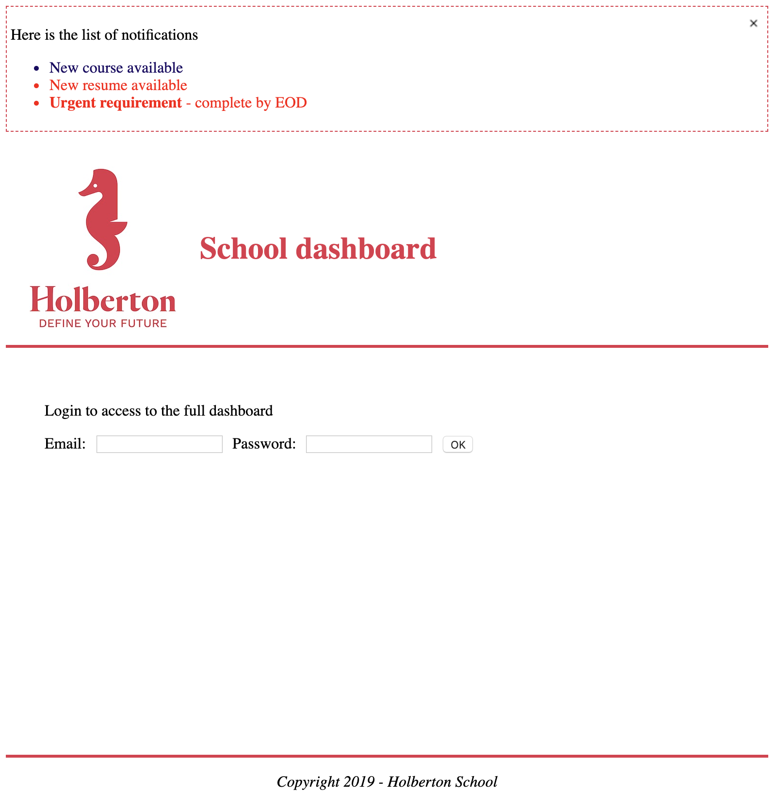

# 0x01. React Intro

## Front-end
- JavaScript
- ES6
- React

## Concepts
For this project, we expect you to focus on the following concept:

- React

## Resources
Read or watch:
- [React Official Website](https://reactjs.org/)
- [Getting Started with React](https://reactjs.org/docs/getting-started.html)
- [React Overview](https://reactjs.org/docs/intro-to-react.html)
- [Create React App](https://create-react-app.dev/)
- [React Developer Tools](https://reactjs.org/blog/2019/08/15/new-react-devtools.html)
- [What is Babel?](https://babeljs.io/docs/en/)
- [Enzyme](https://enzymejs.github.io/enzyme/)

## Learning Objectives
At the end of this project, you are expected to be able to explain to anyone, without the help of Google:

1. How to create a basic JavaScript application using React
2. How to use the package `create-react-app` to start developing quickly with React
3. What JSX is and how to use it
4. How to use the React Developer Tools to debug your code
5. How to use Enzyme’s Shadow rendering to test your application
6. How to use React with Webpack & Babel

## Requirements
- All your files will be interpreted/compiled on Ubuntu 18.04 LTS using Node 12.x.x and npm 6.x.x
- Allowed editors: vi, vim, emacs, Visual Studio Code
- All your files should end with a new line
- A `README.md` file, at the root of the folder of the project, is mandatory

---

### Task 0: Basic Application

**Mandatory**

Create a basic app named `dashboard` using `create-react-app` in your `task_0` directory.

- Download and add the Holberton logo and favicon to the `src/` directory under `dashboard/`.


- Remove the unused files: `service-worker`, `index.css`, `App.test.js`.

- In `task_0/dashboard/src/App.js`, create a function `App` that returns:
  - a header div with a class named `App-header` containing the Holberton logo and an h1 with the text "School dashboard".
  - a body div with a class named `App-body` containing at least one paragraph with the text "Login to access the full dashboard".
  - a footer div with a class named `App-footer` containing at least one paragraph with the text "Copyright 2020 - Holberton School".

- Modify the `App.css` to make the project look like the provided screenshot.


**Requirements:**

- When running, there should not be any lint error in the console.

**Repo:**

- GitHub repository: `alx-react`
- Directory: `0x01-react_intro`
- Files: `task_0/dashboard/src/`, `task_0/dashboard/src/App.css`, `task_0/dashboard/src/App.js`

---

### Task 1: Basic Application

**Mandatory**

**Repo:**

- GitHub repository: `alx-react`
- Directory: `0x00-react_introduction`
- Files: `task_0/dashboard/src/`, `task_0/dashboard/src/App.css`, `task_0/dashboard/src/App.js`

---

### Task 2: Embedding Expressions, Functions

**Mandatory**

Using your code from the previous task, in `task_1/dashboard/src/utils.js`:

- Create a function named `getFullYear` that returns the current year.
- Create a function named `getFooterCopy`:
  - It accepts one argument `isIndex` (boolean).
  - When true, the function should return "Holberton School". When false, the function should return "Holberton School main dashboard".
- Modify the footer returned in `task_1/dashboard/src/App.js` to use these two functions.

In `task_1/dashboard/src/Notifications.js`, create a `Notifications` element:

- It should import React.
- It should export a function.
- The function should return a div with the class `Notifications`.
- The div should contain a paragraph with the text "Here is the list of notifications".
- Import the file `Notifications.css`.

In `task_1/dashboard/src/Notifications.css`, style the `Notifications` class:

- Add a border and some padding around the div.

Render the `Notifications` element:

- Modify `task_1/dashboard/src/index.js` to render the new element (`Notifications`) in a div named `root-notifications`.

Check that you can see the two elements on the browser, and using the React browser extension.

**Requirements:**

- When running, there should not be any lint error in the console.

**Repo:**

- GitHub repository: `alx-react`
- Directory: `0x01-react_intro`
- Files: `task_1/dashboard/src/`, `task_1/dashboard/src/utils.js`, `task_1/dashboard/src/App.js`, `task_1/dashboard/src/Notifications.css`, `task_1/dashboard/src/Notifications.js`, `task_1/dashboard/src/index.js`

---

### Task 3: Modify the App

**Mandatory**

Using your code from the previous task, in `task_2/dashboard/src/App.js` under the paragraph that says "Login to access the full dashboard":

- Add a label and input for email.
- Add a label and input for password.
- When the user clicks on a label, it should select the corresponding input.
- Add one button element with the text "OK".

**Repo:**

- GitHub repository: `alx-react`
- Directory: `0x01-react_intro`
- Files: `task_2/dashboard/src/`, `task_2/dashboard/src/App.js`

---

### Task 4: Modify the Notifications

**Mandatory**

In `task_2/dashboard/src/utils.js`:

- Create a function named `getLatestNotification` that returns the following string: `<strong>Urgent requirement</strong> - complete by EOD`.

In `task_2/dashboard/src/Notifications.js` in the `Notifications` div:

- Add a button element with inline styling (without using the CSS file):
  - Show button on the right side of the notifications box.
  - `aria-label` is "Close".
  - When the user clicks on the button, it logs to the console "Close button has been clicked".
- In the button element, add a children `img` element that will import the `close-icon.png` image.
- After the paragraph, add an unordered list.
  - The list has the following items:
    - The first one has a default priority and says "New course available".
    - The second one has an urgent priority and says "New resume available".
  - Add the priority to the first and second items of the list using a data attribute.
  - The last item correctly displays the content of `getLatestNotification` using `dangerouslySetInnerHTML`.

In `task_2/dashboard/src/Notifications.css`:

- Style the notification priorities using their data attribute: set the color of default items to blue, and the color of urgent items to red.

**Requirements:**

- When running, there should not be any lint error in the console.
- Your app should look like the provided screenshot.




**Repo:**

- GitHub repository: `alx-react`
- Directory: `0x01-react_intro`
- Files: `task_2/dashboard/src/`, `task_2/dashboard/src/utils.js`, `task_2/dashboard/src/Notifications.js`, `task_2/dashboard/src/Notifications.css`

---

### Task 5: Create Basic Tests with Four Tests

**Mandatory**

In `task_3/dashboard/src/utils.test.js`:

- Write a test to check that the function `getFullYear` returns the correct year (be careful not to create a time bomb).
- Write a test to check

 that `getFooterCopy` returns the correct string when the argument is true or false.
- Write a test checking the returned string for `getLatestNotification`.

**Repo:**

- GitHub repository: `alx-react`
- Directory: `0x01-react_intro`
- Files: `task_3/dashboard/src/utils.test.js`

---

### Task 6: Install Enzyme

**Mandatory**

Install Enzyme with npm.

Create a file named `setupTests.js` and configure the adapter for Enzyme.

**Repo:**

- GitHub repository: `alx-react`
- Directory: `0x01-react_intro`
- Files: `task_3/dashboard/src/setupTests.js`

---

### Task 7: Create React Tests

**Mandatory**

In `task_3/dashboard/src/App.test.js`:

- Create four tests:
  - Test that `App` renders without crashing.
  - Verify that `App` renders a div with the class `App-header`.
  - Verify that `App` renders a div with the class `App-body`.
  - Verify that `App` renders a div with the class `App-footer`.

In `task_3/dashboard/src/Notifications.test.js`:

- Create three tests:
  - Test that `Notifications` renders without crashing.
  - Verify that `Notifications` renders three list items.
  - Verify that `Notifications` renders the text "Here is the list of notifications".

**Requirements:**

- When running the test suites, you should see the following result:
  ```
  Test Suites: 3 passed, 3 total
  Tests: 11 passed, 11 total
  ```

- You must use shallow rendering to write the React tests.

**Repo:**

- GitHub repository: `alx-react`
- Directory: `0x01-react_intro`
- Files: `task_3/dashboard/src/App.test.js`, `task_3/dashboard/src/Notifications.test.js`

---

### Task 8: Deploy to a GitHub Page

**Mandatory**

Deploy your application to GitHub Pages using the `gh-pages` branch and `create-react-app`.

Your application should be working correctly when accessing the GitHub URL.

Add URLs here:

**Repo:**

- GitHub repository: `alx-react`
- Directory: `0x01-react_intro`
- Files: `task_4/`

---

### Task 9: Create a Project using Webpack

**Mandatory**

Without reusing `create-react-app` or the code from the previous exercise, start a brand new npm project.

Reusing what you learned during the Webpack module:

- Set up a system to output a `bundle.js` file in a `dist` folder.
- Set up a dev server with hot reloading.
- Create a `src` folder that will contain your Javascript.
- Set up a simple html file in the `dist` folder that will import the bundle file in the body tag.
- Install and configure the various plugins to support:
  - Inline source map.
  - Style loader.
  - CSS loader.
  - Image webpack loader.

**Repo:**

- GitHub repository: `alx-react`
- Directory: `0x01-react_intro`
- Files: `task_5/dashboard/config/webpack.config.js`, `task_5/dashboard/dist/index.html`, `task_5/dashboard/src/index.js`

---

### Task 10: Install Babel

**Mandatory**

Install Babel, and in `task_5/dashboard/.babelrc`, add the presets for `preset-env` and `preset-react`.

Add a `babel-loader` to the Webpack configuration so you can support js and jsx files.

Import the files that you wrote in the previous task. All the Javascript and React code should be within the `src` folder.

At this point, running `webpack-dev-server` should correctly execute your code, and you should be able to see the dashboard like in the last task.

**Repo:**

- GitHub repository: `alx-react`
- Directory: `0x01-react_intro`
- Files: `task_5/dashboard/.babelrc`, `task_5/dashboard/config/webpack.config.js`

---

### Task 11: Reorganize the Files

**Mandatory**

Let’s reorganize the files in our project:

- Every file related to the App, should be within an `App` folder.
- Every file related to the Notifications, should be within a `Notifications` folder.
- Every file related to the utils functions, should be within a `utils` folder.
- Every asset file should be within the `assets` folder.
- Set up the `favicon.ico` in the `dist` folder.
- Webpack config file should be within a `config` folder if it isn’t already.

**Repo:**

- GitHub repository: `alx-react`
- Directory: `0x01-react_intro`
- Files: `task_5/dashboard/src/App/App.css`, `task_5/dashboard/src/App/App.js`, `task_5/dashboard/src/App/App.test.js`, `task_5/dashboard/src/Notifications/Notifications.css`, `task_5/dashboard/src/Notifications/Notifications.js`, `task_5/dashboard/src/Notifications/Notifications.test.js`, `task_5/dashboard/src/utils/utils.js`, `task_5/dashboard/src/utils/utils.test.js`, `task